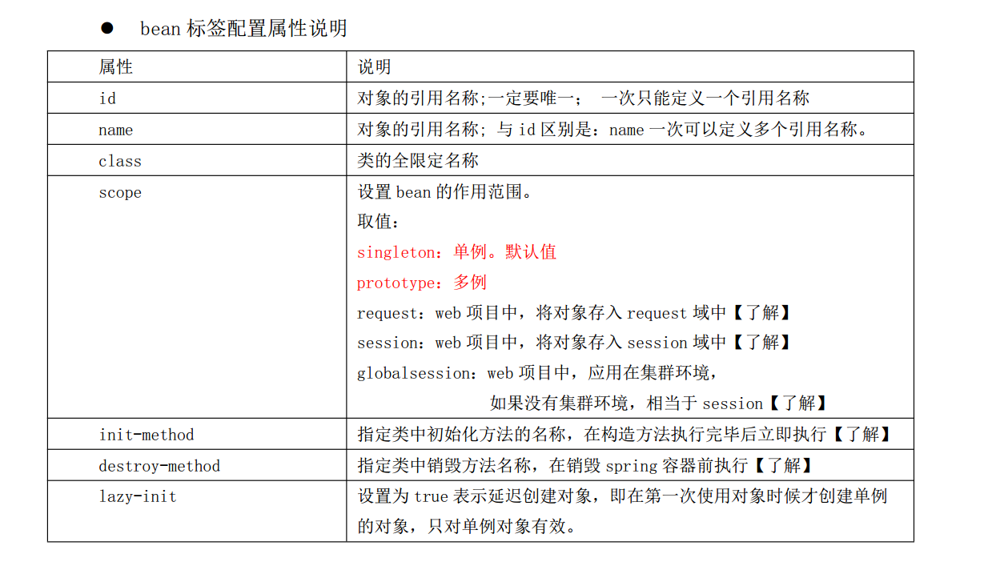

## No.1 框架概述与Spring重要性

### 什么是框架？

> 框架是软件的半成品，已经预先提供了一些功能，我们在框架的基础上做开发，框架已经有的功能可以直接使用。

### 框架的好处

> **简化开发**

> 1.简化开发，因为已经提供了一些功能的实现；

> 2.框架是优秀的程序员写出的优秀的代码形成的工具类，具有可扩展性，设计优良.

> 3.优秀的开源框架，大家都比较熟悉，更适合团队开发。

### 三层架构与常见的框架


**Web层（表现层）**

>SpringMVC

>Struts2


**Service层（业务层）**

>Spring


**Dao层（持久层）**

>JdbcTemplae(Spring)

>MyBatis

>Hibernate/Jpa/SpringDataJpa


**Spring框架在JavaEE的三层架构中都可以完成对应功能开发！！**

### Spring重要性

>Spring是一个家族体系，可以完成JavaEE开发中几乎所有问题！！（Spring会一统Java的天下）

<https://spring.io/projects>

1. Spring  Framework (spring框架   IOC  AOP 事务管理，SpringMVC等)
2. Spring Security（权限校验）
3. Spring Data( 一统持久层天下  mysql，oracle，mongoDB，solr等 )
4. Spring Boot（简化Spring开发）
5. Spring Cloud（分布式开发）
6. Spring AMQP（整合RabbitMQ 消息队列）
7. 。。。。。。

## No.2 Spring（Framework）介绍

**简介:**

>Spring （Framework）框架拥有7个核心模块，都是为JavaEE开发提供基础功能。

**体系结构**


1. Spring Core（IOC容器）：创建对象，给对象属性赋值
2. Spring AOP（面向切面编程）： 事务管理，自定义AOP编程
3. Spring ORM：Spring整合ORM框架（Hibernate/JPA）
4. Spring JDBC： 提供JdbcTemplate的，对Jdbc简单封装
5. Spring Web：Spring整合Web（Servlet，Filter）
6. SpringMVC：Spring提供MVC表现层模块
7. Spring Context： 国际化，事件驱动编程

**<span style="color:red">IOC容器的好处：解耦</span>**

## No.3 程序中解耦应用-工厂模式解耦

>需求：

>>由于客户的数据库环境经常变化，希望更换数据库时候，只需要修改dao的代码，不需要修改service。

**代码实现**

1）Idea工具创建项目Maven项目

2）编写Dao接口和实现

```java
package com.gemin.dao;

/**
 *
 */
public interface UserDao {
    
    public void save();
}
```


```java
package com.gemin.dao.impl;

import com.gemin.dao.UserDao;

/**
 * mysql的Dao实现
 */
public class UserDaoMySQLImpl implements UserDao {
    @Override
    public void save() {
        System.out.println("用户已经保存到mysql数据库");
    }
}
```


3）编写Service接口和实现


```java
package com.gemin.service;

/**
 *
 */
public interface UserService {
    
    public void save();
    
}
```


```java
package com.gemin.service.impl;

import com.gemin.dao.UserDao;
import com.gemin.dao.impl.UserDaoMySQLImpl;
import com.gemin.service.UserService;

/**
 *
 */
public class UserServiceImpl implements UserService {
    
    //创建Dao实现类对象（依赖、耦合）
    private UserDao userDao = new UserDaoMySQLImpl();
    
    
    @Override
    public void save() {
        userDao.save();
    }
}
```


4）编写测试类


```java
package com.gemin.test;

import com.gemin.service.UserService;
import com.gemin.service.impl.UserServiceImpl;

/**
 *
 */
public class UserServiceTest {

    public static void main(String[] args) {
        //1.创建Service对象
        UserService userService = new UserServiceImpl();
        //2.调用service方法
        userService.save();
    }
    
}
```

5）运行测试


这时，项目数据需要从mysql迁移到oracle,意味Dao实现需要更新，但为了遵守开闭原则，我们新建UserDaoOracleImpl进行扩展，但是业务层的UserServiceImpl需要修改代码来切换Dao实现


我们发现，如果每次Dao进行扩展了，Service需要修改源代码，这种做法耦合度比较高！！！

那么怎么呢？  可以使用**工厂模式**解决Service和Dao的耦合问题！！！！


6）设计一个BeanFactory工厂类


```java
package com.gemin.factory;

import com.gemin.dao.UserDao;
import com.gemin.dao.impl.UserDaoOracleImpl;

/**
 * 用于创建对象的工厂类
 */
public class BeanFactory {


    /**
     * 提供创建对象的方法
     */
    public static UserDao getBean(){
        return new UserDaoOracleImpl();
    }

}
```


7）利用工厂来解耦


但是，还是工厂类 不够灵活（每次修改代码），这时优化BeanFactory


8）建立bean.properties，描述了所有可以创建的对象


9）改造BeanFactory


```java
package com.gemin.factory;

import com.gemin.dao.UserDao;
import com.gemin.dao.impl.UserDaoMySQLImpl;
import com.gemin.dao.impl.UserDaoOracleImpl;

import java.util.ResourceBundle;

/**
 * 用于创建对象的工厂类
 */
public class BeanFactory {
    
    //使用ResourceBundle读取properties
    private static ResourceBundle bundle;


   /* *//**
     * 提供创建对象的方法
     *//*
    public static UserDao getBean(){
        return new UserDaoMySQLImpl();
    }*/

    /**
     * 读取bean.properties来创建对象
     */
    public static Object getBean(String key){
        if(bundle==null) {
            //1.加载bean.properties
            //getBundle: 传入properties文件的名称（不需要后缀），用于加载该文件
            bundle = ResourceBundle.getBundle("bean");
        }

        //2.根据传入的key找到vlaue(value只类的全名)
        String className = bundle.getString(key);

        //3.使用反射创建类的对象
        Class<?> clazz = null;
        try {
            clazz = Class.forName(className);
            Object object = clazz.newInstance();

            //4.返回
            return object;
        } catch (Exception e) {
            e.printStackTrace();
          
        }
        return null;
    }
    
}
```


10）Service改造


到这里，任务完成啦，通过工厂模式+配置 最终实现Service和Dao 解耦啦！！！！

## No.4 程序中解耦应用-控制反转

**什么是IOC和DI？**

IOC，Inverse Of Control  控制反转，把创建对象的权力，由自己创建(new)改为工厂来创建。解决创建对象的耦合问题！！！


DI，Denpedency Injection 依赖注入，把对象属性赋值的权力，由自己完成改为工厂来完成。解决给对象属性赋值的耦合问题！！！

**创建对象和属性赋值的细节？**

创建对象（IOC）的细节：

​    1）创建的对象是单例还是多例？      

​    2）创建对象的时机问题（延迟创建）

​    3）创建对象的生命周期问题


给对象属性（DI）赋值的细节

​     1）可以怎么赋值？赋值的方式？

​     2）可以赋什么类型的值？ 基本类型，集合，Java对象等

## No.5 SpringIOC容器(一)入门案例

**步骤**

1.创建项目，导入spring-context（IOC依赖）

2.编写User类

3.编写bean.xml声明对象的创建

4.测试


**实现**

1.创建项目，导入spring-context（IOC依赖）


```xml
<dependencies>
    <!-- Spring IOC容器
      注意：以后导入Spring的其他模块都必须统一版本
     -->
    <dependency>
        <groupId>org.springframework</groupId>
        <artifactId>spring-context</artifactId>
        <version>5.0.2.RELEASE</version>
    </dependency>

</dependencies>
```


2.编写User类


```java
package com.gemin.pojo;

/**
 * 用户实体类
 */
public class User {

    public User(){
        System.out.println("创建了User对象!");
    }

}
```


3.编写bean.xml声明对象的创建（***）

spring配置文件

名称：建议叫bean.xml 或 applicationContext.xml

位置:  放在类路径， resources目录下


内容如下：

找到约束内容


```xml
<?xml version="1.0" encoding="UTF-8"?>
<beans xmlns="http://www.springframework.org/schema/beans"
       xmlns:xsi="http://www.w3.org/2001/XMLSchema-instance"
       xsi:schemaLocation="http://www.springframework.org/schema/beans
        http://www.springframework.org/schema/beans/spring-beans.xsd">
    
    
    <!-- 创建User对象 -->
    <!--
       id: 给创建的对象一个别名（必须唯一的）
       class: 需要创建类的全名
     -->
    <bean id="user" class="com.gemin.pojo.User"></bean>
    
</beans>
```


4.测试


先导入junit依赖

```xml
<dependencies>
    <!-- Spring IOC容器
      注意：以后导入Spring的其他模块都必须统一版本
     -->
    <dependency>
        <groupId>org.springframework</groupId>
        <artifactId>spring-context</artifactId>
        <version>5.0.2.RELEASE</version>
    </dependency>

    <!-- junit测试 -->
    <dependency>
        <groupId>junit</groupId>
        <artifactId>junit</artifactId>
        <version>4.12</version>
    </dependency>
</dependencies>
```

```java
package com.gemin.test;

import com.gemin.pojo.User;
import org.junit.Test;
import org.springframework.context.ApplicationContext;
import org.springframework.context.support.ClassPathXmlApplicationContext;

/**
 * Spring IOC入门
 */
public class Demo1 {

    @Test
    public void test1(){
        //1.创建IOC容器（bean工厂） 类路径方式加载
        ApplicationContext ac = new ClassPathXmlApplicationContext("bean.xml");
        //2.从IOC容器获取对象
        User user = (User)ac.getBean("user");
        //3.输出
        System.out.println(user);
    }


}
```


输出结果：


**小结**

1. 导入spring-context依赖（IOC容器）
2. 编写bean.xml 声明对象的创建： <bean id="别名" class="类的全名"></bean>
3. 测试代码
   1. 创建ApplicationContext对象 （IOC容器）
   2. 使用getBean方法从IOC容器获取对象

## No.6 SpringIOC容器(二)创建对象细节

**bean标签配置细节**

创建对象（IOC）的细节：

​    1）创建的对象是单例还是多例？      

​    2）创建对象的时机问题（延迟创建）

​    3）创建对象的生命周期问题




**代码**

1.bean.xml配置细节


```xml
<?xml version="1.0" encoding="UTF-8"?>
<beans xmlns="http://www.springframework.org/schema/beans"
       xmlns:xsi="http://www.w3.org/2001/XMLSchema-instance"
       xsi:schemaLocation="http://www.springframework.org/schema/beans
        http://www.springframework.org/schema/beans/spring-beans.xsd">


    <!-- 创建User对象 -->
    <!--
       id: 给创建的对象一个别名（必须唯一的）
       class: 需要创建类的全名
     -->
   <!-- <bean id="user2" class="com.gemin.pojo.User"></bean>-->

    <!--
         bean的配置细节
         1) id: 给创建的对象一个别名（必须唯一的） (推荐使用)  ***
         2) class: 需要创建类的全名（注意必须是类的全名）   ***
         3) name: 给创建的对象创建多个别名，别名之间使用,逗号隔开
         4) scope： 创建对象的作用域，创建单例对象还是多例对象   ***
            singleton: 单例的，默认值。每次调用getBean方法获取的对象都是同一个！！！    ***
            prototype: 多例的。每次调用getBean方法都会创建一个新的对象！！
            request: web中使用。每个用户的请求都会创建一个新的对象！！！
            session: web中使用。每个session会话中都会创建一个新的对象！！！
            glbalsession： web中使用。在web集群环境中使用，在同一个集群环境下，只会有一个对象！！
         5)lazy-init: 是否延迟创建对象。
                false: 不延迟，默认值。在创建IOC容器的时候，就会根据bean配置创建好对象，等待程序来获取
                true: 延迟。在创建IOC容器的时候，先不创建对象，等到程序来获取（getBean）的时候再创建对象
         6) init-method和destroy-method： 对象的生命周期方法
                init-method： 初始化方法。在创建完对象后立即调用init-method
                destroy-method： 销毁方法。在销毁对象之前调用destroy-method
     -->
    <bean id="user"
          class="com.gemin.pojo.User"
          name="user3,user4"
          scope="singleton"
          lazy-init="true"
          init-method="init"
          destroy-method="preDestory"></bean>

</beans>
```


2.测试代码


```java
//演示单例或多例
@Test
public void test2(){
    ApplicationContext ac = new ClassPathXmlApplicationContext("bean.xml");
    //从IOC容器获取多次的对象
    for(int i=1;i<=5;i++) {
        User user = (User) ac.getBean("user");
        System.out.println(user);
    }
}

//演示是否延迟创建对象
@Test
public void test3(){
    //1.创建IOC容器（bean工厂） 类路径方式加载
    ApplicationContext ac = new ClassPathXmlApplicationContext("bean.xml");
    //2.从IOC容器获取对象
    User user = (User)ac.getBean("user");
    //3.输出
    System.out.println(user);
}

//演示对象的生命周期方法
@Test
public void test4(){
    //1.创建IOC容器（bean工厂） 类路径方式加载
    ClassPathXmlApplicationContext ac = new ClassPathXmlApplicationContext("bean.xml");
    //2.从IOC容器获取对象
    User user = (User)ac.getBean("user");
    //3.输出
    System.out.println(user);
    //4.销毁IOC容器（关闭IOC）
    ac.close();
}
```

## No.7 SpringIOC容器(三)创建容器几种方式

**目标**

1. 容器接口结构图
2. 代码实现不同的方式创建容器

**容器接口结构图**


**代码**


```java
package com.gemin.test;

import com.gemin.pojo.User;
import org.junit.Test;
import org.springframework.context.ApplicationContext;
import org.springframework.context.support.ClassPathXmlApplicationContext;
import org.springframework.context.support.FileSystemXmlApplicationContext;

/**
 * 演示创建IOC容器的方式
 */
public class Demo2 {

    /**
     * 文件路径方式创建IOC容器：
     *     1. 绝对路径：E:\tensquare_codes\javacode_113\javaee113\spring01_02_ioc\src\main\resources
     *     2. 相对路径： 从项目的src目录开始查询
     */

    //绝对路径
    @Test
    public void test1(){
        ApplicationContext ac = new FileSystemXmlApplicationContext("E:\\tensquare_codes\\javacode_113\\javaee113\\spring01_02_ioc\\src\\main\\resources\\bean.xml");
        User user = (User)ac.getBean("user");
        System.out.println(user);
    }

    //相对路径
    @Test
    public void test2(){
        ApplicationContext ac = new FileSystemXmlApplicationContext("src/main/resources/bean.xml");
        User user = (User)ac.getBean("user");
        System.out.println(user);
    }

    // 使用类路径方式： 项目的类路径，就是在resources目录下 （推荐使用）
    @Test
    public void test3(){
        ApplicationContext ac = new ClassPathXmlApplicationContext("bean.xml");
        User user = (User)ac.getBean("user");
        System.out.println(user);
    }
}
```

## No.8 SpringIOC容器(四)创建对象的三种方式

**目标**

掌握创建对象的三种方式：

方式1：默认无参数构造函数创建对象（推荐方式）

方式2：工厂类的静态方法创建对象 

方式3：工厂类的实例方法创建对象 


**默认无参数构造函数创建对象（最常用）**

步骤：

1.配置bean.xml

2.编写Person类

3.测试


实现：

1.bean.xml配置（***）

使用IDEA创建spirng配置文件


2.Person类（***）


3.测试

```java
package com.gemin.test;

import com.gemin.pojo.Person;
import com.gemin.pojo.User;
import org.junit.Test;
import org.springframework.context.ApplicationContext;
import org.springframework.context.support.ClassPathXmlApplicationContext;
import org.springframework.context.support.FileSystemXmlApplicationContext;

/**
 * 演示IOC容器创建对象的三种的方式
 */
public class Demo3 {


    @Test
    public void test1(){
        ApplicationContext ac = new ClassPathXmlApplicationContext("bean_ioc.xml");
        Person person = (Person)ac.getBean("person");
        System.out.println(person);
    }
}
```


**工厂类的静态方法创建对象**

步骤：

1.编写工厂类，提供静态方法

2.配置bean.xml

3.测试


实现：

1.编写工厂类，提供静态方法

```java
package com.gemin.pojo;

/**
 * 工厂类
 */
public class PersonFactory {

    /**
     * 静态方法
     */
    public static Person getPersonByStatic(){
        return new Person();
    }

}
```


2.配置bean.xml


3.测试


```java
package com.gemin.test;

import com.gemin.pojo.Person;
import com.gemin.pojo.User;
import org.junit.Test;
import org.springframework.context.ApplicationContext;
import org.springframework.context.support.ClassPathXmlApplicationContext;
import org.springframework.context.support.FileSystemXmlApplicationContext;

/**
 * 演示IOC容器创建对象的三种的方式
 */
public class Demo3 {


    @Test
    public void test1(){
        ApplicationContext ac = new ClassPathXmlApplicationContext("bean_ioc.xml");
        Person person = (Person)ac.getBean("person");
        System.out.println(person);
    }
}
```


**工厂类的实例方法创建对象**

步骤：
1.在工厂类添加实例方法

2.配置bean.xml

3.测试


实现：

1.在工厂类添加实例方法


2.配置bean.xml

```xml
<?xml version="1.0" encoding="UTF-8"?>
<beans xmlns="http://www.springframework.org/schema/beans"
       xmlns:xsi="http://www.w3.org/2001/XMLSchema-instance"
       xsi:schemaLocation="http://www.springframework.org/schema/beans http://www.springframework.org/schema/beans/spring-beans.xsd">


    <!--
       IOC容器创建对象的三种方式
     -->
    <!-- 1. 默认无参的构造方式
        注意：需要创建的对象必须提供无参构造方式
    -->
   <!-- <bean id="person" class="com.gemin.pojo.Person"/>-->

    <!-- 2.工厂类的静态方法 -->
    <!--
       底层： Person person = PersonFactory.getPersonByStatic();

       class: 工厂类的全名
       factory-method: 工厂类的一个静态方法名称
     -->
    <!--<bean id="person" class="com.gemin.pojo.PersonFactory" factory-method="getPersonByStatic"></bean>-->

    <!-- 3. 工厂类的实例方法 -->
    <!--
       底层：
           PersonFactory factory = new PersonFactory();
           Person person = factory.getPerson();
     -->
    <!-- 3.1 先创建工厂类对象 -->
    <bean id="factory" class="com.gemin.pojo.PersonFactory"/>
    <!-- 3.2 使用工厂对象调用实例发方法
            factory-bean: 创建工厂对象的id
            factory-method: 工厂类的实例方法
    -->
    <bean id="person" factory-bean="factory" factory-method="getPerson"/>
     
</beans>
```


3.测试

```java
package com.gemin.test;

import com.gemin.pojo.Person;
import com.gemin.pojo.User;
import org.junit.Test;
import org.springframework.context.ApplicationContext;
import org.springframework.context.support.ClassPathXmlApplicationContext;
import org.springframework.context.support.FileSystemXmlApplicationContext;

/**
 * 演示IOC容器创建对象的三种的方式
 */
public class Demo3 {


    @Test
    public void test1(){
        ApplicationContext ac = new ClassPathXmlApplicationContext("bean_ioc.xml");
        Person person = (Person)ac.getBean("person");
        System.out.println(person);
    }
}
```

## No.9 SpringIOC容器(五)依赖注入A-带参数构造函数

**什么是依赖注入？**

DI, 依赖注入，关注的就是怎么给对象的属性去赋值！！！


DI的细节？

1）有什么方式可以给属性赋值？

2）有哪些属性的类型可以赋值？


**构造器赋值**

步骤：

1.在Person类添加带参数的构造方式

2.配置bean.xml

3.测试


实现：

1.在Person类添加带参数的构造方式


2.配置bean.xml

```xml
<?xml version="1.0" encoding="UTF-8"?>
<beans xmlns="http://www.springframework.org/schema/beans"
       xmlns:xsi="http://www.w3.org/2001/XMLSchema-instance"
       xsi:schemaLocation="http://www.springframework.org/schema/beans http://www.springframework.org/schema/beans/spring-beans.xsd">

    <!--
       依赖注入：给对象属性赋值
     -->
    <!-- 1. 带参数的构造方式-->
    <!--
      constructor-arg 标签的使用
        1）value： 需要传递的参数值（仅限基本类型）
        2) index: 参数的索引号，从0开始，不写index，按照配置从下往下的顺序加载
        3) name: 指定方法的形参名称来进行赋值， 不写，就自动匹配形式参数名称
        4）type: 指定方法的参数类型赋值, 默认不写就是String类型
        5) ref: 引用类型，引用IOC容器的另一个bean（对象）
            注意：value和ref只能使用其中一个
     -->
    <bean id="person" class="com.gemin.pojo.Person">
        <!-- 给构造方式传入参数 -->
        <constructor-arg value="10" type="int"/>
        <constructor-arg ref="str"/>

    </bean>

    <!-- 创建String对象 -->
    <!--
      底层：
        String str = new String("小泽");
    -->
    <bean id="str" class="java.lang.String">
        <constructor-arg value="小泽"/>
    </bean>

</beans>
```


3.测试

```java
package com.gemin.test;

import com.gemin.pojo.Person;
import org.junit.Test;
import org.springframework.context.ApplicationContext;
import org.springframework.context.support.ClassPathXmlApplicationContext;

/**
 * 演示依赖注入
 */
public class Demo4 {


    @Test
    public void test1(){
        ApplicationContext ac = new ClassPathXmlApplicationContext("bean_di.xml");
        Person person = (Person)ac.getBean("person");
        System.out.println(person);
    }
}
```

## No.10 SpringIOC容器(六)依赖注入B-set方法

步骤

1.在Person类提供setter方法

2.配置bean.xml

3.测试


实现

1.在Person类提供setter方法


2.配置bean.xml

```xml
<?xml version="1.0" encoding="UTF-8"?>
<beans xmlns="http://www.springframework.org/schema/beans"
       xmlns:xsi="http://www.w3.org/2001/XMLSchema-instance"
       xsi:schemaLocation="http://www.springframework.org/schema/beans http://www.springframework.org/schema/beans/spring-beans.xsd">

    <!--
       依赖注入：给对象属性赋值
     -->
    <!-- 1. 带参数的构造方式-->
    <!--
      constructor-arg 标签的使用
        1）value： 需要传递的参数值（仅限基本类型）
        2) index: 参数的索引号，从0开始，不写index，按照配置从下往下的顺序加载
        3) name: 指定方法的形参名称来进行赋值， 不写，就自动匹配形式参数名称
        4）type: 指定方法的参数类型赋值, 默认不写就是String类型
        5) ref: 引用类型，引用IOC容器的另一个bean（对象）
            注意：value和ref只能使用其中一个
     -->
    <bean id="person2" class="com.gemin.pojo.Person">
        <!-- 给构造方式传入参数 -->
        <constructor-arg value="10" type="int"/>
        <constructor-arg ref="str"/>

    </bean>

    <!-- 创建String对象 -->
    <!--
      底层：
        String str = new String("小泽");
    -->
    <bean id="str" class="java.lang.String">
        <constructor-arg value="小泽"/>
    </bean>

    <!-- 2. 使用setter方法注入 -->
    <!--
       property: 通过调用setter进行赋值
          name: setter方法名称。去掉set，把首字母小写
     -->
    <bean id="person" class="com.gemin.pojo.Person">
        <property name="id" value="666"/>
        <property name="username" ref="str"/>
    </bean>

</beans>
```


3.测试

```java
package com.gemin.test;

import com.gemin.pojo.Person;
import org.junit.Test;
import org.springframework.context.ApplicationContext;
import org.springframework.context.support.ClassPathXmlApplicationContext;

/**
 * 演示依赖注入
 */
public class Demo4 {


    @Test
    public void test1(){
        ApplicationContext ac = new ClassPathXmlApplicationContext("bean_di.xml");
        Person person = (Person)ac.getBean("person");
        System.out.println(person);
    }
}
```

## No.11 SpringIOC容器(七)依赖注入C-p名称空间

**分析**

p名称空间注入，本质也是setter方法注入。


**实现**

步骤：

1.给Person类提供setter方法

2.配置bean.xml

3.测试


实现：

1.给Person类提供setter方法


2.配置bean.xml

先导入p名称空间


3.测试

```java
package com.gemin.test;

import com.gemin.pojo.Person;
import org.junit.Test;
import org.springframework.context.ApplicationContext;
import org.springframework.context.support.ClassPathXmlApplicationContext;

/**
 * 演示依赖注入
 */
public class Demo4 {


    @Test
    public void test1(){
        ApplicationContext ac = new ClassPathXmlApplicationContext("bean_di.xml");
        Person person = (Person)ac.getBean("person");
        System.out.println(person);
    }
}
```

## No.12 SpringIOC容器(八)给集合属性赋值

**实现**

步骤：

1.在Person类提供一些集合类型

2.配置bean.xml

3.测试


实现：

1.在Person类提供一些集合类型

```java
package com.gemin.pojo;

import java.util.List;
import java.util.Map;
import java.util.Properties;
import java.util.Set;

/**
 *
 */
public class Person {

    //定义属性
    private int id;
    private String username;
    private String sex;

    public Person(){
        System.out.println("创建Person对象！！");
    }


    //方式一：使用带参数的构造方式进行属性的依赖注入
    public Person(int id,String username){
        this.id = id;
        this.username = username;

    }
    public Person(String sex,String username){
        this.sex = sex;
        this.username = username;
    }

    //方式二：使用setter方法对属性辅助
    public void setId(int id) {
        System.out.println("调研Person的setId");
        this.id = id;
    }

    public void setUsername(String username) {
        System.out.println("调研Person的setUsername");
        this.username = username;
    }

    //集合类型
    private List<String> list;
    private Set<String> set;
    private Map<String,String> map;
    private String[] array;
    private Properties properties;


    public void setSex(String sex) {
        this.sex = sex;
    }

    public void setList(List<String> list) {
        this.list = list;
    }

    public void setSet(Set<String> set) {
        this.set = set;
    }

    public void setMap(Map<String, String> map) {
        this.map = map;
    }

    public void setArray(String[] array) {
        this.array = array;
    }

    public void setProperties(Properties properties) {
        this.properties = properties;
    }

    @Override
    public String toString() {
        return "Person{" +
                "id=" + id +
                ", username='" + username + '\'' +
                ", sex='" + sex + '\'' +
                '}';
    }
}
```


2.配置bean.xml

```xml
<!-- 集合类型注入 -->
<bean id="person" class="com.gemin.pojo.Person">
    <!-- 1.注入List -->
    <property name="list">
        <list>
            <value>小苍</value>
            <value>小泽</value>
            <ref bean="str"/>
        </list>
    </property>

    <!--2.注入Set -->
    <property name="set">
        <set>
            <value>小苍</value>
            <value>小玛</value>
            <ref bean="str"/>
        </set>
    </property>

    <!--3.注入Map -->
    <property name="map">
        <map>
           <entry key="1001" value="小苍"></entry>
           <entry key="1002" value="小玛"></entry>
           <entry key="1003" value-ref="str"></entry>
        </map>
    </property>

    <!--
      4.注入数组
    -->
    <property name="array">
        <array>
            <value>小苍</value>
            <value>小泽</value>
            <ref bean="str"/>
        </array>
    </property>

    <!-- 5.注入Properties
      注意：Properties 类型不能使用ref引用类型
    -->
    <property name="properties">
        <props>
            <prop key="1001">小苍</prop>
            <prop key="1002">小泽</prop>
            <prop key="1003">小玛</prop>
        </props>
    </property>
</bean>
```


3.测试


```java
package com.gemin.test;

import com.gemin.pojo.Person;
import org.junit.Test;
import org.springframework.context.ApplicationContext;
import org.springframework.context.support.ClassPathXmlApplicationContext;

/**
 * 演示依赖注入
 */
public class Demo4 {


    @Test
    public void test1(){
        ApplicationContext ac = new ClassPathXmlApplicationContext("bean_di.xml");
        Person person = (Person)ac.getBean("person");
        System.out.println(person);
    }
}
```
