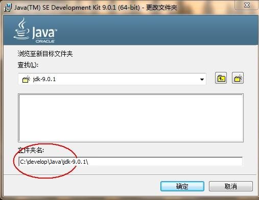

# No.1 初识Java

---

## Java语言概述

### 什么是Java语言

>Java语言是美国Sun公司（Stanford University Network/斯坦福大学网络公司），在1995年推出的高级的编程语言。所谓编程语言，是计算机的语言，人们可以使用编程语言对计算机下达命令，让计算机完成人们需要的功能。Java可运行于多个平台，如Windows, Mac OS，及其他多种UNIX版本的系统。

## Java语言能做什么

### Java的技术体系

>Sun根据应用的领域不同把Java技术划归为三个平台，依次是**Java SE，Java EE ，Java ME**

1.Java SE

>Java SE 是Java平台标准版的简称（Java Platform, Standard Edition） ，用于开发和部署桌面、服务器以及嵌入设备和实时环境中的Java应用程序。Java SE包括用于开发Java Web服务的类库，同时，Java SE为Java EE和Java ME提供了基础。我们在基础阶段学习的技术都是属于Java SE领域的内容。

2.Java EE

>Java EE是Java平台企业版的简称（Java Platform  Enterprise Edition），用于开发便于组装、健壮、可扩展、安全的服务器端Java应用。Java EE建立于Java SE之上，具有Web服务、组件模型、以及通信API等特性，这些为面向服务的架构（SOA）以及开发Web2.0应用提供了支持。我们在就业班和企业级应用技术属于这个领域。

3.Java ME

>Java ME是Java微版的简称（Java Platform Micro Edition），是一个技术和规范的集合，它为移动设备（包括消费类产品、嵌入式设备、高级移动设备等）提供了基于Java环境的开发与应用平台。

### 桌面应用程序

>桌面程序的开发几乎不流行，Java并不擅长做桌面程序，Java可以做桌面程序。

### 嵌入设备中的应用程序

### 大型互联网系统开发（Java的核心用途，工作的主要内容）

>Java语言主要应用在互联网程序的开发领域。常见的互联网程序比如天猫、京东、物流系统、网银系统等，以及服务器后台处理大数据的存储、查询、数据挖掘等也有很多应用。
>
>
>Java不只是做web系统，可以做服务器，做数据分析系统，做视频监控视频，轨道，智慧城市。
>
>Java是兼容并包的语言：体系很庞大，但是功能很丰富，有一站式解决方案，安全，可以做高并发系统 。

## Java语言发展历史

### 版本升级历史

>**詹姆斯•高斯林**（James Gosling）1977年获得了加拿大卡尔加里大学计算机科学学士学位，1983年获得了美国卡内基梅隆大学计算机科学博士学位，毕业后到IBM工作，设计IBM第一代工作站NeWS系统，但不受重视。后来转至Sun公司，1990年，与Patrick，Naughton和Mike Sheridan等人合作“绿色计划”，后来发展一套语言叫做“Oak”，后改名为Java。
**Java**是印度尼西亚`爪哇岛`的英文名称，爪哇岛因盛产咖啡而闻名。Java创始人员团队中其中一名成员想起自己在Java岛（爪哇岛）上曾喝过一种美味的咖啡。
>
>>- 1995年Sun公司发布Java1.0版本（初始化版本）
>>- 1997年发布Java 1.1版本
>>- 1998年发布Java 1.2版本
>>- 2000年发布Java 1.3版本
>>- 2002年发布Java 1.4版本
>>- 2004年发布Java 1.5版本
>>- 2006年发布Java 1.6版本
>>- 2009年sun帝国死了。Oracle甲骨文公司收购Sun公司，并于2011发布Java 1.7版本，所以Java从此之后一直由Oracle公司管理。
>>- 2014年发布Java 1.8版本
>>- 2017年发布Java 9.0版本
>>- 2018年发布Java 10.0版本
>>- 2019 年已经是 Java 12版本

***

# No.2 Java开发环境介绍与搭建

***

## Java的组成

### JVM(Java虚拟机)

>**JVM**（Java Virtual Machine ）：Java虚拟机，简称JVM，是运行所有Java程序的假想计算机，是Java程序的运行环境，是Java 最具吸引力的特性之一。我们编写的Java代码，最终都运行在`JVM` 之上。

### JRE

>**JRE** (Java Runtime Environment) ：是Java程序的运行时环境，包含`JVM 和运行时所需要的核心类库`。如果程序员想要运行一个已经开发好的Java程序，那么只需要安装好JRE即可。

### JDK

>**JDK**(Java Development Kit) ：是Java程序开发工具包，包含`JRE` 和开发人员使用的工具。我们想要运行一个已有的Java程序，那么只需安装`JRE` 即可。我们想要开发一个全新的Java程序，那么必须安装`JDK` 。

### 小结

>1.从上面的产品介绍可以看出，JRE是包括JVM加上运行类库的，JDK包含了编译器等开发工具如后续即将介绍的javac或者java命令工具然后在加上JRE的。
>
>2.如果程序员想要运行一个已经开发好的Java程序，那么只需要安装好JRE即可。但如果想开发一个新的Java程序应该安装JDK。
>
>3.简言之：**使用JDK安装完成Java程序，交给JRE去运行即可**。
>
>4.因为JDK已经包含了JRE,所以我们需要安装JDK即可。

## Java跨平台的原理

>**跨平台**：任何软件的运行，都必须要运行在操作系统之上，而我们用Java编写的软件可以运行在任何的操作系统上，这个特性称为**Java语言的跨平台特性**(“一次编写,处处运行”)。该特性是由JVM实现的，我们编写的程序运行在JVM上，而JVM运行在操作系统上。
>
>**Java语言之所以可以跨平台的根本原因是因为JVM虚拟机**。Java程序运行在Java虚拟机上，每个操作系统下都有不同版本的虚拟机。  

## 计算机的交互方式

>人机交互技术是指通过计算机输入、输出设备，以有效的方式实现人与计算机对话的技术。计算机的交互方式包含可视化界面的方式（鼠标，键盘，触摸等操作）， 语音识别，体感技术等，CLI方式（字符操作界面）等形式。

### 可视化界面方式

>显示器上的功能操作可以直接通过鼠标，键盘，触摸等完成。

### 语音识别，体感技术等

>应用场景如天猫精灵，汽车系统服务，等。

### CLI方式（字符操作界面）

>在早期的DOS操作系统中，是需要通过字符操作界面书写命令操作计算机的，Java语言的初学者，学习一些DOS命令，会非常有帮助。DOS是一个早期的操作系统，现在已经被Windows系统取代，对于我们开发人员，目前还是需要在DOS中完成一些事情，因此就需要掌握一些必要的命令。

### 常用DOS命令

- **进入DOS操作窗口**

  >- 按下Windows+R键盘，打开运行窗口，输入cmd回车，进入到DOS的操作窗口。

  >- 打开DOS命令行后，看到一个路径`c:\user\xxx`就表示我们现在操作的是`c:\user\xxx`这个文件夹。

- **常用命令**

  | 命令               | 操作符号      |
  | ------------------ | ------------- |
  | 盘符切换           | `盘符名:`     |
  | 查看当前文件夹内容 | `dir`        |
  | 进入文件夹         | `cd 文件夹名` |
  | 退出文件夹         | `cd..`        |
  | 退出到磁盘根目录   | `cd\`         |
  | 清屏               | `cls`         |
  |系统时间           | `time`          |
  |修改系统时间           | `date`          |

> 注意:cd到其他盘的文件夹中还需要切换盘符
> **DOS常用命令练习**
> 盘符切换:
> ​D:/

## JDK 9安装图解

至此，我们已经讲解完了Java开发环境的所有准备知识，从上述内容中我们得出结论，进行Java开发，需要安装Java的产品JDK，以下是安装详解。





> **TIP**：
>
> 安装路径中，不要包含中文和空格。因为计算机对中文和空格目录是比较敏感的，在以后的开发中可能这种安装形式会出现一些问题。

## 环境变量的配置

### 什么是环境变量

>虽然我们在上述步骤中已经安装好了JDK,但是操作系统并不知道我们JDK安装到了哪里，同时开发运行Java程序，需要使用JDK中提供的工具命令，工具在JDK9安装目录的`bin` 目录下。**配置完环境变量后我们可以在任意的目录下都可以使用JDK的开发工具。**
>
>如果需要使用这些工具命令，在DOS命令行下是不能直接使用这些工具的，就要先进入到JDK的bin目录下才可以使用，这个过程就会非常的麻烦。
>
>如果不进入JDK的`bin`目录，这些工具就不能使用，会报错。

为了开发方便，我们想**在任意的目录下都可以使用JDK的开发工具**，则必须要配置环境变量，配置环境变量的意义在于告诉操作系统，我们使用的JDK安装到了哪里，同时告诉操作系统我们的开发工具在哪个目录下。

### 配置环境变量步骤

>上节中已经说明了环境变量的作用，我们需要配置JAVA_HOME说明Java的安装目录，我们同时也需要配置PATH环境变量说明Java的开发工具安装到了哪里，详细步骤如下：

#### Windows 7/8版本安装步骤

1. 计算机鼠标右键,选择`属性 `
<br/>
2. 选择`高级系统设置` 
<br/>
3. `高级` 选项卡，点击`环境变量` 
<br/>
4. 点击`新建` ，创建新的环境变量
<br/>
5. 变量名输入`JAVA_HOME`，变量值输入JDK9的安装目录 `c:\Java9\jdk-9.0.1` 
<br/>
6. 选中`Path` 环境变量，`双击`或者`点击编辑`
  > **TIP**:
  >
  > Path中`C:\ProgrammaData\Oracle\Java...`，该路径是安装后默认配置的路径，可以删除。

7.在变量值的最前面，键入`%JAVA_HOME%\bin;`  分号必须要写，必须是英文格式。


#### Windows 10版本安装步骤
1. 文件资源管理器 --> 此电脑鼠标右键 --> 选择`属性 ` 
<br/>
2. 选择`高级系统设置`  --> 选择  `环境变量`
<br/>
3. 点击下方系统变量的 `新建` ，创建新的环境变量，变量名输入`JAVA_HOME`，变量值输入JDK9的安装目录 `C:\develop\Java\jdk-9.0.1` 
<br/>
4. 选中`Path` 环境变量，`双击`或者`点击编辑`
<br/>
5. 点击`新建`，键入`%JAVA_HOME%\bin` ，必须是英文格式。选中该行，上移到最上方，点击确定。

### 检测配置是否成功

>1.环境变量配置完成，重新开启DOS命令行，在任意目录下输入`javac` 命令。

 >2.如果输入“Javac”命令有提示，接下来还需要输入“java -version”命令，看提示的版本号与安装是否一致，一致则说明安装最终已经成功。

***

# No.3 第一个Java程序HelloWorld

***

## 程序开发步骤说明

Java程序开发三步骤：**编写（写代码）**、**编译（翻译）**、**运行（跑起来）**。

## 编写HelloWorld源程序

```java
public class HelloWorld {
  	public static void main(String[] args) {
    	System.out.println("Hello World!");
  	}
}
```

> 文件名必须是`HelloWorld` ，保证文件名和类的名字是一致的，注意大小写。
>

第一个`HelloWord` 源程序就编写完成了，但是这个文件是程序员编写的，JVM是看不懂的，也就不能运行，因此我们必须将编写好的`Java源文件` 编译成JVM可以看懂的`字节码文件` 。

## 编译HelloWorld源文件

在DOS命令行中，**进入Java源文件的目录**d:\day01(根据你们自己的源文件目录)，使用`javac` 命令进行编译。

命令：

```java
javac Java源文件名.后缀名
```

举例：

```java
javac HelloWorld.java
```

编译成功后，命令行没有任何提示。打开`d:\day01`目录，发现产生了一个新的文件 `HelloWorld.class`，该文件就是编译后的文件，是Java的可运行文件，称为**字节码文件**，有了字节码文件，就可以运行程序了。 

> Java源文件的编译工具`javac.exe`，在JDK安装目录的bin目录下。但是由于配置了环境变量，可以再任意目录下使用。

## 运行HelloWorld程序

在DOS命令行中，**进入Java源文件的目录**d:\day01，使用`java` 命令进行运行。

命令：

```java
java 类名字
```

举例：

```
java HelloWorld
```

> java HelloWord  不要写 不要写 不要写 .class
> 
> Java程序`.class文件` 的运行工具`java.exe` ，在JDK安装目录的bin目录下。但是由于配置了环境变量，可以再任意目录下使用java命令了。

## 入门程序小结

### 编译和运行是两回事

* **编译**：是指将我们编写的Java源文件翻译成JVM认识的class文件，在这个过程中，`javac` 编译器会检查我们所写的程序是否有错误，有错误就会提示出来，如果没有错误就会编译成功。
* **运行**：是指将`class文件` 交给JVM去运行，此时JVM就会去执行我们编写的程序了。

### 关于main方法

* **main方法**：称为主方法。写法是**固定格式**不可以更改。main方法是程序的入口点或起始点，无论我们编写多少程序，JVM在运行的时候，都会从main方法这里开始执行。

***
# No.4 基本软件和基本概念
***

## 基本软件

* 前期阶段本人比较推荐Sublime或者notepad++进行Java代码的练习，后期阶段再使用专业的IDE集成工具IDEA、Eclipse等

## 注释comment

注释是对代码解释和说明的文字。其目的是让人们能够更加轻松地了解代码。为代码添加注释，是十分必须要的，注释是给人看的，它不影响程序的编译和运行。

Java中的注释包含单行注释，多行注释和文档注释。

### 单行注释

单行注释以 `//开头 换行结束`，每个单行注释只能注释一行注释信息。

### 多行注释

多行注释以 `/*开头  以*/结束`，多行注释可以注释多行注释信息。

### 文档注释

文档注释以`/**开头  以*/结束`,文档注释也可以注释多行信息。

### 三种注释的区别

1.单行注释只能注释一行，

2.多行注释和文档注释都可以注释多行。

3.文档注释一般用于注释在类，方法，成员变量上（后续会遇到这些成员），文档注释的内容是可以提取到API文档中去的,下节将介绍如何生成API文档。

### javadoc命令生成API文档

1. 在`d:\day01` 目录下新建文本文件，完整的文件名修改为`HelloWorld.java`，其中文件名为`HelloWorld`，后缀名必须为`.java` 。
<br/>
2. 用记事本打开
<br/>
3. 在文件中键入文本并保存，代码如下：

   ```java
   /**
    * @author Mr.Ge
    * @version 1.0
    * 这个是一个入门的Java代码，这是我们的第一个代码HelloWord
    */
   public class HelloWorld {
       /**
        * @param args
        * 这是程序的入口方法名称叫main
        * 这个方法启动的时候会自动执行
        */
       public static void main(String[] args) {
           System.out.println("Hello,World!");
       }
   }
  
    ```
4. 打开DOS界面，进入到d:\day01目录下,输入
   ```java
   javadoc  -charset GBK HelloWorld.java
   ```
5. 进入到d:/day01目录下。双击index.html，可以观察到文档注释的信息提取到了API文档中去
